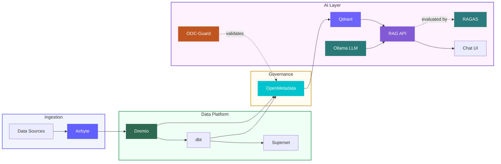

# ArcaP — Open Data Platform

A self-hosted data lakehouse with integrated AI capabilities: local LLM inference, RAG-based data querying, and metadata governance via OpenMetadata.

[](CHANGELOG.md)
[](https://python.org)
[](LICENSE)
[](docs/i18n/)
[](https://www.linkedin.com/company/talentysdata)
[](https://github.com/Monsau/ArcaP)

**Created by:** [Mustapha Fonsau](https://www.linkedin.com/in/mustapha-fonsau/) at [Talentys](https://talentys.eu) | [GitHub](https://github.com/Monsau) | [LinkedIn Talentys](https://www.linkedin.com/company/talentysdata)

<p align="center">
  
  <br/>
  <em>Open Data Platform · <a href="https://github.com/Monsau/ArcaP">github.com/Monsau/ArcaP</a> · <a href="https://www.linkedin.com/in/mustapha-fonsau/">LinkedIn Mustapha</a> · <a href="https://www.linkedin.com/company/talentysdata">LinkedIn Talentys</a></em>
</p>

> ArcaP is a **self-hosted, open-source Data Lakehouse** combining Airbyte, Dremio, dbt, Apache Superset, OpenMetadata and a fully local AI stack (Ollama + Qdrant + RAG API). All computation stays on-premise — no cloud APIs, no usage costs.
>
> **GitHub Topics:** `data-platform` `data-lakehouse` `airbyte` `dremio` `dbt` `superset` `openmetadata` `rag` `ollama` `qdrant` `local-llm` `mlops` `data-engineering` `self-hosted` `open-source`

> 📖 **Main documentation in English.** Translations available in 17 additional languages below.

---

## Available Languages

**English** (You are here) | [Français](docs/i18n/fr/README.md) | [Español](docs/i18n/es/README.md) | [Português](docs/i18n/pt/README.md) | [中文](docs/i18n/cn/README.md) | [日本語](docs/i18n/jp/README.md) | [Русский](docs/i18n/ru/README.md) | [العربية](docs/i18n/ar/README.md) | [Deutsch](docs/i18n/de/README.md) | [한국어](docs/i18n/ko/README.md) | [हिन्दी](docs/i18n/hi/README.md) | [Indonesia](docs/i18n/id/README.md) | [Türkçe](docs/i18n/tr/README.md) | [Tiếng Việt](docs/i18n/vi/README.md) | [Italiano](docs/i18n/it/README.md) | [Nederlands](docs/i18n/nl/README.md) | [Polski](docs/i18n/pl/README.md) | [Svenska](docs/i18n/se/README.md)

---

## Overview

Self-hosted data lakehouse combining ingestion, transformation, BI, and a local AI stack under one Docker Compose setup. All computation stays on-premise — no cloud APIs, no usage costs.



### Key Features

**Data Platform:**
- Airbyte 2.0.0 for data ingestion (300+ connectors)
- Dremio 26.0 data lakehouse with Apache Polaris Iceberg catalog
- dbt 1.10+ for SQL transformations and lineage
- Apache Superset 4.1.2 for dashboards and BI
- 21 automated data quality tests
- Arrow Flight for real-time Dremio ↔ PostgreSQL sync
- Documentation in 18 languages

**AI and Governance:**
- Local LLM inference via Ollama (Llama 3.1, Mistral, Phi3)
- Vector search with Qdrant v1.17.1 (cosine similarity, 384-dim embeddings)
- OpenMetadata 1.12.4 as governance Source of Truth
- Governance-first RAG: metadata catalog queried before operational data
- Document ingestion: PDF, Word, Excel, CSV, JSON, TXT, Markdown
- Documents archived to MinIO before vector processing
- **OLM-Guard** (Llama Guard 3): input/output safety validation on every query
- **RAGAS**: automated faithfulness, relevancy, and precision scoring of RAG answers
- **OOC-Guard**: 3-layer ontology contract validator (Syntax → OWL 2 → SHACL)
- Fully on-premise — no cloud API calls, no usage fees

---

## About this Project

**ArcaP** (Arc Data Platform) is built and maintained by [Mustapha Fonsau](https://www.linkedin.com/in/mustapha-fonsau/) at [**Talentys**](https://talentys.eu) — a Data Engineering & Analytics consultancy.

| | |
|---|---|
| **Organization** | [Talentys](https://talentys.eu) |
| **LinkedIn (company)** | [linkedin.com/company/talentysdata](https://www.linkedin.com/company/talentysdata) |
| **LinkedIn (author)** | [linkedin.com/in/mustapha-fonsau](https://www.linkedin.com/in/mustapha-fonsau/) |
| **GitHub** | [github.com/Monsau/ArcaP](https://github.com/Monsau/ArcaP) |
| **License** | MIT |
| **Current version** | 4.3.0 |

### Why ArcaP?

Most open data stacks require stitching together 10+ separate tools with no unified entry point. ArcaP delivers a **single Docker Compose setup** that wires all layers together — ingestion, storage, transformation, BI, governance, and AI — with sane defaults and one-command deployment.

### Machine-readable discovery

- [`llms.txt`](llms.txt) — structured summary for AI engines (LLM crawlers, RAG indexers)
- [`SECURITY.md`](SECURITY.md) — vulnerability reporting policy
- [`.github/ISSUE_TEMPLATE/`](.github/ISSUE_TEMPLATE/) — standardized issue templates
- [`.github/workflows/ci.yml`](.github/workflows/ci.yml) — automated CI (lint, YAML validation, security scan)

---

## Quick Start

### Prerequisites

- Docker 20.10+ and Docker Compose 2.0+
- Python 3.11 or higher
- Minimum 8 GB RAM (16 GB recommended for AI services)
- 30 GB available disk space (includes LLM models)
- Optional: NVIDIA GPU for faster LLM inference

### One-Command Deployment

Use the **orchestrate_platform.py** script for automatic setup:

```bash
# Full deployment (Data Platform + AI Services)
python orchestrate_platform.py

# Windows PowerShell
$env:PYTHONIOENCODING="utf-8"
python -u orchestrate_platform.py

# Skip AI services if not needed
python orchestrate_platform.py --skip-ai

# Skip infrastructure (if already running)
python orchestrate_platform.py --skip-infrastructure
```

**What it does:**
- Validates prerequisites (Docker, Docker Compose, Python 3.11+)
- Starts all Docker services
- Deploys the AI stack (Ollama, Qdrant, RAG API, Embedding Service, Chat UI)
- Configures Airbyte, Dremio, dbt
- Runs dbt transformations and quality tests
- Creates Superset dashboards
- Prints a deployment summary with all service URLs

### Manual Installation

```bash
# Clone repository
git clone https://github.com/Monsau/ArcaP.git
cd ArcaP

# Install dependencies
pip install -r requirements.txt

# Start infrastructure (Data Platform + AI Services)
docker-compose -f docker-compose.yml -f docker-compose-airbyte-stable.yml -f docker-compose-ai.yml up -d

# Or just data platform (no AI)
docker-compose -f docker-compose.yml -f docker-compose-airbyte-stable.yml up -d

# Or use make commands
make up

# Verify installation
make status

# Run quality tests
make dbt-test
```

### Access Services

**Data Platform:**

| Service | URL | Credentials |
|---------|-----|-------------|
| Airbyte | http://localhost:8000 | airbyte / password |
| Dremio | http://localhost:9047 | admin / admin123 |
| Superset | http://localhost:8088 | admin / admin |
| MinIO Console | http://localhost:9001 | minioadmin / minioadmin123 |
| PostgreSQL | localhost:5432 | postgres / postgres123 |

**AI Services:**

| Service | URL | Description |
|---------|-----|-------------|
| **AI Chat UI** | http://localhost:8501 | Natural language interface for data queries |
| RAG API | http://localhost:8002 | REST API for AI queries + RAGAS evaluation |
| RAG API Docs | http://localhost:8002/docs | Interactive API documentation |
| Qdrant UI | http://localhost:6333/dashboard | Vector database UI |
| Ollama LLM | http://localhost:11434 | Local LLM server (Llama 3.1) |
| Embedding Service | http://localhost:8001 | Text-to-vector conversion |
| **OOC-Guard API** | http://localhost:8003 | Ontology contract validator (OLM) |
| OOC-Guard Docs | http://localhost:8003/docs | Interactive API documentation |
| **OpenMetadata** | http://localhost:8585 | Metadata governance catalog |

---

## Architecture

### System Components

#### Data Platform

| Component | Version | Port | Description |
|-----------|---------|------|-------------|
| **Airbyte** | 2.0.0 | 8000 | Data integration platform (300+ connectors) |
| **Dremio** | 26.0 | 9047, 32010 | Data lakehouse engine |
| **dbt** | 1.10+ | — | SQL transformations and data lineage |
| **Superset** | 4.1.2 | 8088 | Business intelligence and dashboards |
| **PostgreSQL** | 16 | 5432 | Transactional database |
| **MinIO** | latest | 9000, 9001 | S3-compatible object storage |
| **Elasticsearch** | 8.11.4 | 9200 | Search engine (used by OpenMetadata) |
| **MySQL** | 8.4 | 3307 | OpenMetadata backend database |
| **Airflow** | 3.0.0 | 8080 | Workflow orchestration |

#### AI Services

| Component | Version | Port | Description |
|-----------|---------|------|-------------|
| **Ollama** | latest | 11434 | Local LLM server (Llama 3.1, Mistral, Phi3) |
| **Qdrant** | 1.17.1 | 6333, 6334 | Vector database (REST + gRPC) |
| **OpenMetadata** | 1.12.4 | 8585 | Metadata governance catalog |
| **RAG API** | — | 8002 | FastAPI RAG orchestration service |
| **Embedding Service** | — | 8001 | all-MiniLM-L6-v2 text embeddings |
| **AI Chat UI** | — | 8501 | Streamlit natural language query interface |
| **OLM-Guard** | llama-guard3:8b | — | Input/output safety validation (Llama Guard 3) |
| **RAGAS** | — | — | RAG quality evaluation (faithfulness, relevancy, precision) |
| **OOC-Guard** | 0.1.0 | 8003 | Ontology contract validator (Syntax → OWL 2 → SHACL) |

### Architecture Diagrams

- [System Architecture with Airbyte](docs/diagrams/architecture-with-airbyte.mmd)
- [Data Flow](docs/diagrams/data-flow.mmd)
- [Airbyte Workflow](docs/diagrams/airbyte-workflow.mmd)
- [Deployment](docs/diagrams/deployment.mmd)
- [User Journey](docs/diagrams/user-journey.mmd)

---

## Metadata Governance — OpenMetadata

OpenMetadata 1.12.4 is the governance backbone of ArcaP. It sits between the data lakehouse and the AI layer: it catalogues every asset produced in the platform, builds end-to-end lineage, and feeds the RAG system with structured knowledge.

### Role in the Platform

```
Airbyte ──▶ Dremio ──▶ dbt ──▶ Superset
               │          │
               ▼          ▼
           OpenMetadata (catalog + lineage)
               │
               ▼
        Qdrant om_knowledge collection
               │
               ▼
         RAG System (governance-first)
```

The RAG pipeline queries `om_knowledge` **before** `data_platform_knowledge`. Every answer from the AI Chat UI is grounded in the governed metadata catalog — table descriptions, column definitions, data quality results, and ownership — not raw data alone.

### Configured Connectors

| Connector | Ingestion | Capabilities |
|-----------|-----------|--------------|
| **Dremio** | Scheduled daily at 02:00 | Tables, views, VDS lineage, column profiling |
| **dbt** | After each `dbt run` | Model lineage, test results, exposures |
| **PostgreSQL** | Scheduled daily | Tables, column stats, data quality |
| **Airflow** | Pipeline events | DAG lineage, task-level traceability |

### What Gets Catalogued

- **Tables & Views** — every Dremio space, PostgreSQL schema, and dbt model
- **Column-level Lineage** — traces a BI metric back to its raw source across Airbyte → Dremio → dbt → Superset
- **Data Quality Results** — dbt test outcomes surfaced as quality badges in the catalog
- **Ownership & Tags** — data stewards assigned per domain; PII / sensitive columns tagged automatically
- **Business Glossary** — shared term definitions linked to physical columns
- **Descriptions** — auto-populated from dbt `description` fields and enriched collaboratively

### Access

| Interface | URL | Credentials |
|-----------|-----|-------------|
| **Catalog UI** | http://localhost:8585 | admin / admin |
| **REST API** | http://localhost:8585/api/v1 | JWT Bearer token |
| **Swagger** | http://localhost:8585/swagger-ui | — |
| **Health** | http://localhost:8585/api/v1/health | — |

### Backend Services

OpenMetadata requires two backing services that run alongside it:

| Service | Port | Purpose |
|---------|------|---------|
| MySQL 8.4 | 3307 | Metadata storage |
| Elasticsearch 8.11.4 | 9200 | Full-text search index |

### Governance-First RAG

The AI ingestion pipeline runs on a schedule and feeds OpenMetadata context into Qdrant:

```bash
# Trigger a manual metadata sync to Qdrant
python scripts/auto-sync-dremio-openmetadata.py
```

The `om_knowledge` Qdrant collection stores:
- Table and column descriptions from the catalog
- Data lineage summaries
- Data quality test results
- Business glossary definitions
- Dataset ownership and stewardship metadata

Answers produced by the AI Chat UI always cite which catalog entries contributed context.

### Full Documentation

- [OpenMetadata Setup Guide](openmetadata/README.md)
- [Integration Plan](openmetadata/INTEGRATION_PLAN.md)
- [Deployment Summary](openmetadata/DEPLOYMENT_SUMMARY.md)
- [Verification Checklist](openmetadata/VERIFICATION_CHECKLIST.md)
- [GenAI Integration](openmetadata/OMD_GENAI_INTEGRATION.md)

---

## Multilingual Support

This project provides complete documentation in **18 languages**, covering **5.2B+ people** (70% of global population):

| Language | Documentation | Data Generation | Native Speakers |
|----------|---------------|-----------------|-----------------|
| English | [README.md](README.md) | `--language en` | 1.5B |
| Français | [docs/i18n/fr/](docs/i18n/fr/README.md) | `--language fr` | 280M |
| Español | [docs/i18n/es/](docs/i18n/es/README.md) | `--language es` | 559M |
| Português | [docs/i18n/pt/](docs/i18n/pt/README.md) | `--language pt` | 264M |
| العربية | [docs/i18n/ar/](docs/i18n/ar/README.md) | `--language ar` | 422M |
| 中文 | [docs/i18n/cn/](docs/i18n/cn/README.md) | `--language cn` | 1.3B |
| 日本語 | [docs/i18n/jp/](docs/i18n/jp/README.md) | `--language jp` | 125M |
| Русский | [docs/i18n/ru/](docs/i18n/ru/README.md) | `--language ru` | 258M |
| Deutsch | [docs/i18n/de/](docs/i18n/de/README.md) | `--language de` | 134M |
| 한국어 | [docs/i18n/ko/](docs/i18n/ko/README.md) | `--language ko` | 81M |
| हिन्दी | [docs/i18n/hi/](docs/i18n/hi/README.md) | `--language hi` | 602M |
| Indonesia | [docs/i18n/id/](docs/i18n/id/README.md) | `--language id` | 199M |
| Türkçe | [docs/i18n/tr/](docs/i18n/tr/README.md) | `--language tr` | 88M |
| Tiếng Việt | [docs/i18n/vi/](docs/i18n/vi/README.md) | `--language vi` | 85M |
| Italiano | [docs/i18n/it/](docs/i18n/it/README.md) | `--language it` | 85M |
| Nederlands | [docs/i18n/nl/](docs/i18n/nl/README.md) | `--language nl` | 25M |
| Polski | [docs/i18n/pl/](docs/i18n/pl/README.md) | `--language pl` | 45M |
| Svenska | [docs/i18n/se/](docs/i18n/se/README.md) | `--language se` | 13M |

### Generate Multilingual Test Data

```bash
# Generate French customer data (CSV format)
python config/i18n/data_generator.py --language fr --records 1000 --format csv

# Generate Spanish product data (JSON format)
python config/i18n/data_generator.py --language es --records 500 --format json

# Generate Chinese user data (Parquet format)
python config/i18n/data_generator.py --language cn --records 2000 --format parquet
```

Configuration: [config/i18n/config.json](config/i18n/config.json)

---

## AI-Powered Data Insights

The platform includes a complete **AI/LLM stack** for natural language data querying and insights.

### Quick Start with AI

1. **Deploy Platform** (includes AI services):
   ```bash
   python orchestrate_platform.py
   ```

2. **Access AI Chat Interface**:
   - Open http://localhost:8501
   - Use the sidebar to ingest data from your PostgreSQL or Dremio tables

3. **Ingest Your Data** (via sidebar):
   ```
   Option 1: Upload Documents (NEW!)
   - Click "Choose files to upload"
   - Select PDF, Word, Excel, CSV, or other files
   - Add optional tags/source
   - Click "Upload & Ingest Documents"
   
   Option 2: From Database
   Table: customers
   Text column: description
   Metadata: customer_id,name,segment
   → Click "Ingest PostgreSQL"
   ```

4. **Ask Questions** (examples):
   - "What are the key trends in our sales data?"
   - "Show me customer segments with highest revenue"
   - "Are there any data quality issues in the orders table?"
   - "Generate a SQL query to find recent high-value customers"
   - "Explain the ETL pipeline for product data"

### AI Architecture

```
User Question → Chat UI → RAG API → Query Embedding
                                  ↓
                          Vector Search (Qdrant)
                                  ↓
                          Retrieve Context Documents
                                  ↓
                          Build Prompt with Context
                                  ↓
                          Local LLM (Ollama/Llama 3.1)
                                  ↓
                          AI-Generated Answer + Sources
```

### AI Services Available

| Service | URL | Purpose |
|---------|-----|---------|
| **AI Chat UI** | http://localhost:8501 | Interactive Q&A interface |
| **RAG API** | http://localhost:8002 | REST API for AI queries |
| **RAG API Docs** | http://localhost:8002/docs | Interactive API documentation |
| **Ollama LLM** | http://localhost:11434 | Local LLM server (Llama 3.1) |
| **Qdrant Vector DB** | localhost:6333 | Semantic search database |
| **Embedding Service** | http://localhost:8001 | Text-to-vector conversion |

### Programmatic Access

**Python Example:**

```python
import httpx

# Ask a question
response = httpx.post(
    "http://localhost:8002/query",
    json={
        "question": "What are our top products?",
        "top_k": 5,
        "model": "llama3.1"
    }
)

result = response.json()
print(f"Answer: {result['answer']}")
print(f"Sources: {len(result['sources'])} documents")
```

**cURL Example:**

```bash
curl -X POST http://localhost:8002/query \
  -H "Content-Type: application/json" \
  -d '{
    "question": "What trends do you see in customer data?",
    "top_k": 5,
    "model": "llama3.1",
    "temperature": 0.7
  }'
```

### Download Additional LLM Models

```bash
# Mistral (faster, good for coding)
docker exec ollama ollama pull mistral

# Phi3 (lightweight, quick responses)
docker exec ollama ollama pull phi3

# CodeLlama (code generation)
docker exec ollama ollama pull codellama

# List available models
docker exec ollama ollama list
```

### AI Features

- All computation is local: no cloud API calls, no data leaves your infrastructure
- Qdrant vector DB with cosine similarity search across 384-dim embeddings
- Dual-collection RAG: `om_knowledge` (OpenMetadata governance) and `data_platform_knowledge` (operational)
- Governance-first mode: metadata context prioritized over raw data context
- Supported models: Llama 3.1, Mistral, Phi3, CodeLlama
- Scheduled ingestion from PostgreSQL tables and Dremio spaces
- Source attribution in every answer: shows which documents contributed to the response

### Comprehensive Guide

For detailed AI services documentation, see:
- [AI Services Guide](AI_SERVICES_GUIDE.md) - Complete guide with architecture, configuration, troubleshooting
- [Quick Start Guide](QUICK_START.md) - Fast AI setup with examples
- [Platform Status](PLATFORM_STATUS.md) - All services including AI

---

## Documentation

### For Different Roles

**Data Engineers**
- [Getting Started](docs/i18n/en/getting-started/)
- [dbt Models](dbt/README.md)
- [Data Quality Tests](reports/phase3/PHASE3_SUCCESS_REPORT.md)

**Data Analysts**
- [Superset Dashboards](reports/superset/SUPERSET_DREMIO_FINAL.md)
- [Query Examples](docs/i18n/en/guides/)
- [Open Data Dashboard](opendata/README.md)

**Developers**
- [API Documentation](docs/i18n/en/api/)
- [Contributing Guide](CONTRIBUTING.md)
- [Architecture](docs/i18n/en/architecture/)

**DevOps**
- [Deployment Guide](docs/i18n/en/architecture/)
- [Docker Configuration](docker-compose.yml)
- [Monitoring Setup](docs/i18n/en/guides/)

---

## Common Commands

```bash
# Infrastructure Management
make up              # Start all services
make down            # Stop all services
make restart         # Restart services
make status          # Check service status
make logs            # View service logs

# Data Transformation (dbt)
make dbt-run         # Run transformations
make dbt-test        # Run quality tests
make dbt-docs        # Generate documentation
make dbt-clean       # Clean artifacts

# Data Synchronization
make sync            # Manual sync Dremio to PostgreSQL
make sync-auto       # Auto sync every 5 minutes

# Testing & Quality
make test            # Run all tests
make lint            # Code quality checks
make format          # Format code

# Deployment
make deploy          # Complete deployment
make deploy-quick    # Quick deployment
```

---

## Project Status

```
Services: 9/9 operational (includes Airbyte)
dbt Tests: 21/21 passing
Dashboards: 3 active
Languages: 18 supported (5.2B+ people coverage)
Documentation: Complete in 18 languages
Status: Production Ready — v4.3.0
```

---

## Project Structure

```
ArcaP/
├── README.md                       # This file
├── llms.txt                        # AI/LLM engine discovery (AIEO)
├── AUTHORS.md                      # Project creators and contributors
├── CHANGELOG.md                    # Version history
├── CONTRIBUTING.md                 # Contribution guidelines
├── CODE_OF_CONDUCT.md              # Community guidelines
├── SECURITY.md                     # Security policy and vulnerability reporting
├── LICENSE                         # MIT License
│
├── .github/                        # GitHub-specific files
│   ├── ISSUE_TEMPLATE/             # Bug report & feature request templates
│   ├── PULL_REQUEST_TEMPLATE.md    # PR checklist
│   ├── CODEOWNERS                  # Code ownership
│   ├── FUNDING.yml                 # Sponsorship links
│   └── workflows/ci.yml            # CI: lint, YAML validate, security scan
│
├── docs/                           # Documentation
│   ├── i18n/                       # Multilingual docs (18 languages)
│   │   ├── fr/, es/, pt/, cn/, jp/, ru/, ar/
│   │   ├── de/, ko/, hi/, id/, tr/, vi/
│   │   └── it/, nl/, pl/, se/
│   └── diagrams/                   # Mermaid diagrams (248+)
│
├── config/                         # Configuration
│   └── i18n/                       # Internationalization
│       ├── config.json
│       └── data_generator.py
│
├── dbt/                            # Data transformations
│   ├── models/                     # SQL models
│   ├── tests/                      # Quality tests
│   └── dbt_project.yml
│
├── ai-services/                    # AI stack
│   ├── rag-api/                    # FastAPI RAG orchestration + OLM-Guard + RAGAS
│   ├── embedding/                  # Text embedding service
│   ├── chat-ui/                    # Streamlit AI chat interface
│   ├── ollama/                     # Local LLM server models
│   └── ooc-guard/                  # Ontology contract validator (OLM, 3-layer)
│
├── openmetadata/                   # Governance integration
├── k8s/                            # Kubernetes / Helm deployment
├── airflow/                        # Workflow orchestration DAGs
├── scripts/                        # Automation scripts
└── docker-compose*.yml             # Infrastructure definitions
```

---

## Contributing

We welcome contributions from the community. Please see:
- [Contributing Guidelines](CONTRIBUTING.md)
- [Code of Conduct](CONTRIBUTING.md#code-of-conduct)
- [Development Setup](docs/i18n/en/getting-started/)

### Adding a New Language

1. Add language configuration to `config/i18n/config.json`
2. Create documentation directory: `docs/i18n/[language-code]/`
3. Translate README and guides
4. Update main README language table
5. Submit pull request

---

## License

This project is licensed under the MIT License. See [LICENSE](LICENSE) file for details.

---

## Acknowledgments

**Supported by [Talentys](https://talentys.eu) | [LinkedIn](https://www.linkedin.com/company/talentysdata)** - Data Engineering and Analytics Excellence

Built with enterprise-grade open-source technologies:

**Data Platform:**
- [Airbyte](https://airbyte.com/) - Data integration platform (300+ connectors)
- [Dremio](https://www.dremio.com/) - Data lakehouse platform
- [dbt](https://www.getdbt.com/) - Data transformation tool
- [Apache Superset](https://superset.apache.org/) - Business intelligence platform
- [Apache Arrow](https://arrow.apache.org/) - Columnar data format
- [PostgreSQL](https://www.postgresql.org/) - Relational database
- [MinIO](https://min.io/) - Object storage
- [Elasticsearch](https://www.elastic.co/) - Search and analytics

**AI Services:**
- [Ollama](https://ollama.ai/) - Local LLM server
- [Llama 3.1](https://ai.meta.com/llama/) - Meta's open-source LLM (8B parameters)
- [Qdrant](https://qdrant.tech/) - Vector database for semantic search
- [sentence-transformers](https://www.sbert.net/) - Text embedding models
- [FastAPI](https://fastapi.tiangolo.com/) - Modern web framework for APIs
- [Streamlit](https://streamlit.io/) - App framework for ML/AI projects

---

## Contact

**Author:** Mustapha Fonsau
- **Organization:** [Talentys](https://talentys.eu) | [LinkedIn](https://www.linkedin.com/company/talentysdata)
- **LinkedIn:** [linkedin.com/in/mustapha-fonsau](https://www.linkedin.com/in/mustapha-fonsau/)
- **GitHub:** [github.com/Monsau](https://github.com/Monsau)
- **Email:** mfonsau@talentys.eu

## Support

For technical assistance:
- **Documentation:** [docs/i18n/](docs/i18n/)
- **Issue Tracker:** [GitHub Issues](https://github.com/Monsau/ArcaP/issues)
- **Discussions:** [GitHub Discussions](https://github.com/Monsau/ArcaP/discussions)

---

**Version 4.3.0** | **2026-05-20** | **Production Ready**

Made by [Mustapha Fonsau](https://www.linkedin.com/in/mustapha-fonsau/) at [Talentys](https://talentys.eu) — [LinkedIn Talentys](https://www.linkedin.com/company/talentysdata) · [LinkedIn Mustapha](https://www.linkedin.com/in/mustapha-fonsau/)
