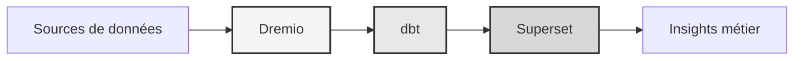

#منصة البيانات

**حل مستودع بيانات المؤسسة**

**اللغة**: الفرنسية (الفرنسية)  
**الإصدار**: 3.3.1  
**آخر تحديث**: 19 أكتوبر 2025

---

## ملخص

منصة بيانات احترافية تجمع بين Dremio وdbt وApache Superset لتحويل البيانات على مستوى المؤسسات وضمان الجودة وذكاء الأعمال.

توفر هذه المنصة حلاً كاملاً لهندسة البيانات الحديثة، بما في ذلك خطوط البيانات الآلية واختبار الجودة ولوحات المعلومات التفاعلية.



---

## الميزات الرئيسية

- تصميم مبنى بحيرة البيانات باستخدام Dremio
- التحولات الآلية مع dbt
- ذكاء الأعمال مع Apache Superset
- اختبار شامل لجودة البيانات
- المزامنة في الوقت الحقيقي عبر رحلة السهم

---

## دليل البدء السريع

### المتطلبات الأساسية

- دوكر 20.10 أو أعلى
- Docker Compose 2.0 أو أعلى
- بايثون 3.11 أو أعلى
- ذاكرة وصول عشوائي (RAM) لا تقل عن 8 جيجابايت

### منشأة

```bash
# Installer les dépendances
pip install -r requirements.txt

# Démarrer les services
make up

# Vérifier l'installation
make status

# Exécuter les tests de qualité
make dbt-test
```

---

## بنيان

### مكونات النظام

| مكون | ميناء | الوصف |
|---------------|------|-------------|
| دريميو | 9047, 31010, 32010 | منصة بحيرة البيانات |
| دي بي تي | - | أداة تحويل البيانات |
| سوبرسيت | 8088 | منصة ذكاء الأعمال |
| بوستجرس كيو ال | 5432 | قاعدة بيانات المعاملات |
| مينيو | 9000، 9001 | تخزين الكائنات (متوافق مع S3) |
| البحث المرن | 9200 | محرك بحث وتحليل |

راجع [وثائق الهندسة المعمارية](الهندسة المعمارية/) للحصول على تصميم مفصل للنظام.

---

## التوثيق

### بدء
- [دليل التثبيت](البدء/)
- [التكوين](البدء/)
- [البدء](البدء/)

### أدلة المستخدم
- [هندسة البيانات](أدلة/)
- [إنشاء لوحات المعلومات](guides/)
- [تكامل واجهة برمجة التطبيقات](أدلة/)

### وثائق واجهة برمجة التطبيقات
- [مرجع REST API](api/)
- [المصادقة](واجهة برمجة التطبيقات/)
- [أمثلة التعليمات البرمجية](api/)

### وثائق الهندسة المعمارية
- [تصميم النظام](الهندسة المعمارية/)
- [تدفق البيانات](الهندسة المعمارية/)
- [دليل النشر](الهندسة المعمارية/)
- [🎯 الدليل المرئي لمنافذ Dremio](architecture/dremio-ports-visual.md) ⭐ جديد

---

## اللغات المتاحة

| اللغة | الكود | التوثيق |
|--------|------|---------------|
| الإنجليزية | إن | [README.md](../../../README.md) |
| الفرنسية | إن | [docs/i18n/fr/](../fr/README.md) |
| الاسبانية | واس | [docs/i18n/es/](../es/README.md) |
| البرتغالية | حزب العمال | [docs/i18n/pt/](../pt/README.md) |
| العربية | ع | [docs/i18n/ar/](../ar/README.md) |
| 中文 | سي ان | [docs/i18n/cn/](../cn/README.md) |
| 日本語 | جي بي | [docs/i18n/jp/](../jp/README.md) |
| Русский | المملكة المتحدة | [docs/i18n/ru/](../ru/README.md) |

---

## يدعم

للمساعدة الفنية:
- التوثيق: [README main](../../../README.md)
- تعقب المشكلات: مشكلات GitHub
- منتدى المجتمع: مناقشات جيثب
- البريد الإلكتروني: support@example.com

---

**[العودة إلى الوثائق الرئيسية](../../../README.md)**