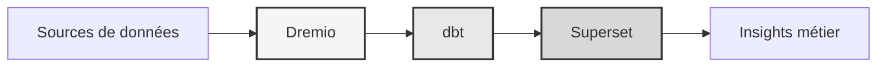

# Datenplattform

**Enterprise Data Lakehouse-Lösung**

**Sprache**: Französisch (FR)  
**Version**: 3.3.1  
**Letzte Aktualisierung**: 19. Oktober 2025

---

## Übersicht

Professionelle Datenplattform, die Dremio, dbt und Apache Superset für Datentransformation, Qualitätssicherung und Business Intelligence auf Unternehmensniveau kombiniert.

Diese Plattform bietet eine Komplettlösung für modernes Data Engineering, einschließlich automatisierter Datenpipelines, Qualitätstests und interaktiver Dashboards.



---

## Hauptmerkmale

- Daten-Lakehouse-Architektur mit Dremio
- Automatisierte Transformationen mit dbt
- Business Intelligence mit Apache Superset
- Umfassende Prüfung der Datenqualität
- Echtzeitsynchronisierung über Arrow Flight

---

## Kurzanleitung

### Voraussetzungen

- Docker 20.10 oder höher
- Docker Compose 2.0 oder höher
- Python 3.11 oder höher
- Mindestens 8 GB RAM

### Einrichtung

```bash
# Installer les dépendances
pip install -r requirements.txt

# Démarrer les services
make up

# Vérifier l'installation
make status

# Exécuter les tests de qualité
make dbt-test
```

---

## Architektur

### Systemkomponenten

| Komponente | Hafen | Beschreibung |
|---------------|------|-------------|
| Dremio | 9047, 31010, 32010 | Data Lakehouse-Plattform |
| dbt | - | Datentransformationstool |
| Obermenge | 8088 | Business-Intelligence-Plattform |
| PostgreSQL | 5432 | Transaktionsdatenbank |
| MinIO | 9000, 9001 | Objektspeicher (S3-kompatibel) |
| Elasticsearch | 9200 | Such- und Analysemaschine |

Ausführliche Informationen zum Systemdesign finden Sie in der [Architekturdokumentation](architecture/).

---

## Dokumentation

### Start-up
- [Installationsanleitung](erste Schritte/)
- [Konfiguration](erste Schritte/)
- [Erste Schritte](getting-started/)

### Benutzerhandbücher
- [Datentechnik](Anleitungen/)
- [Erstellung von Dashboards](guides/)
- [API-Integration](guides/)

### API-Dokumentation
- [REST-API-Referenz](api/)
- [Authentifizierung](api/)
- [Codebeispiele](api/)

### Architekturdokumentation
- [Systemdesign](Architektur/)
- [Datenfluss](architecture/)
- [Bereitstellungsleitfaden](architecture/)
- [🎯 Dremio Ports Visual Guide](architecture/dremio-ports-visual.md) ⭐ NEU

---

## Verfügbare Sprachen

| Sprache | Code | Dokumentation |
|--------|------|---------------|
| Englisch | DE | [README.md](../../../README.md) |
| Französisch | DE | [docs/i18n/fr/](../fr/README.md) |
| Spanisch | ES | [docs/i18n/es/](../es/README.md) |
| Portugiesisch | PT | [docs/i18n/pt/](../pt/README.md) |
| العربية | AR | [docs/i18n/ar/](../ar/README.md) |
| 中文 | CN | [docs/i18n/cn/](../cn/README.md) |
| 日本語 | JP | [docs/i18n/jp/](../jp/README.md) |
| Russisch | Großbritannien | [docs/i18n/ru/](../ru/README.md) |

---

## Unterstützung

Für technische Unterstützung:
- Dokumentation: [README main](../../../README.md)
- Issue Tracker: GitHub-Probleme
- Community-Forum: GitHub-Diskussionen
- E-Mail: support@example.com

---

**[Zurück zur Hauptdokumentation](../../../README.md)**