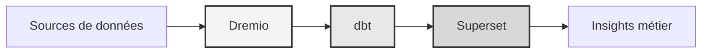

# डेटा प्लेटफ़ॉर्म

**एंटरप्राइज़ डेटा लेकहाउस समाधान**

**भाषा**: फ्रेंच (एफआर)  
**संस्करण**: 3.3.1  
**अंतिम अद्यतन**: 19 अक्टूबर, 2025

---

## अवलोकन

एंटरप्राइज़-ग्रेड डेटा परिवर्तन, गुणवत्ता आश्वासन और व्यावसायिक बुद्धिमत्ता के लिए ड्रेमियो, डीबीटी और अपाचे सुपरसेट का संयोजन करने वाला व्यावसायिक डेटा प्लेटफ़ॉर्म।

यह प्लेटफ़ॉर्म आधुनिक डेटा इंजीनियरिंग के लिए एक संपूर्ण समाधान प्रदान करता है, जिसमें स्वचालित डेटा पाइपलाइन, गुणवत्ता परीक्षण और इंटरैक्टिव डैशबोर्ड शामिल हैं।



---

## प्रमुख विशेषताऐं

- ड्रेमियो के साथ डेटा लेकहाउस आर्किटेक्चर
- डीबीटी के साथ स्वचालित परिवर्तन
- अपाचे सुपरसेट के साथ बिजनेस इंटेलिजेंस
- व्यापक डेटा गुणवत्ता परीक्षण
- एरो फ़्लाइट के माध्यम से वास्तविक समय सिंक्रनाइज़ेशन

---

## तुरत प्रारम्भ निर्देशिका

### पूर्वावश्यकताएँ

- डॉकर 20.10 या उच्चतर
- डॉकर कंपोज़ 2.0 या उच्चतर
- पायथन 3.11 या उच्चतर
- न्यूनतम 8 जीबी रैम

### सुविधा

```bash
# Installer les dépendances
pip install -r requirements.txt

# Démarrer les services
make up

# Vérifier l'installation
make status

# Exécuter les tests de qualité
make dbt-test
```

---

## वास्तुकला

### सिस्टम घटक

| घटक | बंदरगाह | विवरण |
|----------------------|------|----------------|
| ड्रेमियो | 9047, 31010, 32010 | डेटा लेकहाउस प्लेटफ़ॉर्म |
| डीबीटी | - | डेटा परिवर्तन उपकरण |
| सुपरसेट | 8088 | बिजनेस इंटेलिजेंस प्लेटफार्म |
| पोस्टग्रेएसक्यूएल | 5432 | लेन-देन संबंधी डेटाबेस |
| मिनिओ | 9000, 9001 | ऑब्जेक्ट भंडारण (S3 संगत) |
| इलास्टिक्स खोज | 9200 | खोज और विश्लेषण इंजन |

विस्तृत सिस्टम डिज़ाइन के लिए [आर्किटेक्चर दस्तावेज़](आर्किटेक्चर/) देखें।

---

## दस्तावेज़ीकरण

### चालू होना
- [इंस्टालेशन गाइड](आरंभ करना/)
- [कॉन्फ़िगरेशन](आरंभ करना/)
- [आरंभ करना](आरंभ करना/)

### उपयोगकर्ता गाइड
- [डेटा इंजीनियरिंग](गाइड/)
- [डैशबोर्ड का निर्माण](गाइड/)
- [एपीआई एकीकरण](मार्गदर्शिकाएं/)

### एपीआई दस्तावेज़ीकरण
- [रेस्ट एपीआई संदर्भ](एपीआई/)
- [प्रमाणीकरण](एपीआई/)
- [कोड उदाहरण](एपीआई/)

### वास्तुकला दस्तावेज़ीकरण
- [सिस्टम डिज़ाइन](वास्तुकला/)
- [डेटा प्रवाह](वास्तुकला/)
- [परिनियोजन गाइड](वास्तुकला/)
- [🎯 ड्रेमियो पोर्ट्स विज़ुअल गाइड](आर्किटेक्चर/ड्रेमियो-पोर्ट्स-विज़ुअल.एमडी) ⭐ नया

---

## उपलब्ध भाषाएँ

| भाषा | कोड | दस्तावेज़ीकरण |
|--------|------|------------|
| अंग्रेजी | एन | [README.md](../../../README.md) |
| फ़्रेंच | एन | [docs/i18n/fr/](../fr/README.md) |
| स्पैनिश | ईएस | [docs/i18n/es/](../es/README.md) |
| पुर्तगाली | पीटी | [docs/i18n/pt/](../pt/README.md) |
| العربية | एआर | [docs/i18n/ar/](../ar/README.md) |
| 中文 | सीएन | [docs/i18n/cn/](../cn/README.md) |
| 日本語 | जेपी | [docs/i18n/jp/](../jp/README.md) |
| Русский | यूके | [docs/i18n/ru/](../ru/README.md) |

---

## सहायता

तकनीकी सहायता के लिए:
- दस्तावेज़ीकरण: [रीडमी मुख्य](../../../README.md)
- इश्यू ट्रैकर: गिटहब इश्यूज
- सामुदायिक मंच: GitHub चर्चाएँ
- ईमेल: support@example.com

---

**[मुख्य दस्तावेज़ पर लौटें](../../../README.md)**