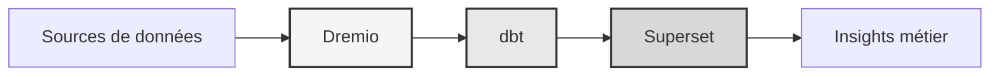

# データプラットフォーム

**エンタープライズ データ レイクハウス ソリューション**

**言語**: フランス語 (フランス)  
**バージョン**: 3.3.1  
**最終更新日**: 2025 年 10 月 19 日

---

＃＃ 概要

Dremio、dbt、Apache Superset を組み合わせたプロフェッショナル データ プラットフォームで、エンタープライズ グレードのデータ変換、品質保証、ビジネス インテリジェンスを実現します。

このプラットフォームは、自動化されたデータ パイプライン、品質テスト、対話型ダッシュボードなど、最新のデータ エンジニアリングのための完全なソリューションを提供します。



---

## 主な機能

- Dremio を使用したデータ レイクハウス アーキテクチャ
- dbt による自動変換
- Apache スーパーセットによるビジネス インテリジェンス
- 包括的なデータ品質テスト
- Arrow Flight によるリアルタイム同期

---

## クイック スタート ガイド

### 前提条件

- Docker 20.10以降
- Docker Compose 2.0以降
- Python 3.11以降
- 最小 8 GB の RAM

＃＃＃ 施設

```bash
# Installer les dépendances
pip install -r requirements.txt

# Démarrer les services
make up

# Vérifier l'installation
make status

# Exécuter les tests de qualité
make dbt-test
```

---

＃＃ 建築

### システムコンポーネント

|コンポーネント |ポート |説明 |
|---------------|------|---------------|
|ドレミオ | 9047、31010、32010 |データ レイクハウス プラットフォーム |
| dbt | - |データ変換ツール |
|スーパーセット | 8088 |ビジネス インテリジェンス プラットフォーム |
|ポストグレSQL | 5432 |トランザクションデータベース |
|みにお | 9000、9001 |オブジェクトストレージ (S3 互換) |
|エラスティックサーチ | 9200 |検索および分析エンジン |

詳細なシステム設計については、[アーキテクチャ ドキュメント](architecture/) を参照してください。

---

## ドキュメント

＃＃＃ 起動する
- [インストールガイド](はじめに/)
- [設定](はじめに/)
- [はじめに](getting-started/)

### ユーザーガイド
- [データエンジニアリング](ガイド/)
- [ダッシュボードの作成](ガイド/)
- [API統合](guides/)

### API ドキュメント
- [REST APIリファレンス](api/)
- [認証](api/)
- [コード例](api/)

### アーキテクチャのドキュメント
- [システム設計](アーキテクチャ/)
- [データフロー](アーキテクチャ/)
- [導入ガイド](アーキテクチャ/)
- [🎯 Dremio Ports ビジュアルガイド](architecture/dremio-ports-visual.md) ⭐ NEW

---

## 利用可能な言語

|言語 |コード |ドキュメント |
|-------|------|------|
|英語 | JP | [README.md](../../../README.md) |
|フランス語 | JP | [docs/i18n/fr/](../fr/README.md) |
|スペイン語 |エス | [docs/i18n/es/](../es/README.md) |
|ポルトガル語 | PT | [docs/i18n/pt/](../pt/README.md) |
| और देखें AR | [docs/i18n/ar/](../ar/README.md) |
| 中国語 | CN | [docs/i18n/cn/](../cn/README.md) |
| 日本語 |日本 | [docs/i18n/jp/](../jp/README.md) |
| Русский |英国 | [docs/i18n/ru/](../ru/README.md) |

---

＃＃ サポート

技術的なサポートについては:
- ドキュメント: [README メイン](../../../README.md)
- 問題トラッカー: GitHub の問題
- コミュニティ フォーラム: GitHub ディスカッション
- 電子メール: support@example.com

---

**[メインドキュメントに戻る](../../../README.md)**