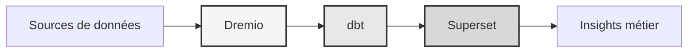

# 데이터 플랫폼

**엔터프라이즈 데이터 레이크하우스 솔루션**

**언어**: 프랑스어(프랑스어)  
**버전**: 3.3.1  
**최종 업데이트**: 2025년 10월 19일

---

## 개요

엔터프라이즈급 데이터 변환, 품질 보증 및 비즈니스 인텔리전스를 위해 Dremio, dbt 및 Apache Superset을 결합한 전문 데이터 플랫폼입니다.

이 플랫폼은 자동화된 데이터 파이프라인, 품질 테스트 및 대화형 대시보드를 포함하여 최신 데이터 엔지니어링을 위한 완벽한 솔루션을 제공합니다.



---

## 주요 기능

- Dremio를 사용한 데이터 레이크하우스 아키텍처
- dbt를 이용한 자동 변환
- Apache Superset을 통한 비즈니스 인텔리전스
- 종합적인 데이터 품질 테스트
- Arrow Flight를 통한 실시간 동기화

---

## 빠른 시작 가이드

### 전제조건

- 도커 20.10 이상
- Docker Compose 2.0 이상
- 파이썬 3.11 이상
- 최소 8GB RAM

### 시설

```bash
# Installer les dépendances
pip install -r requirements.txt

# Démarrer les services
make up

# Vérifier l'installation
make status

# Exécuter les tests de qualité
make dbt-test
```

---

## 건축학

### 시스템 구성요소

| 구성요소 | 포트 | 설명 |
|---------------|------|---------------|
| 드레미오 | 9047, 31010, 32010 | 데이터 레이크하우스 플랫폼 |
| DBT | - | 데이터 변환 도구 |
| 슈퍼세트 | 8088 | 비즈니스 인텔리전스 플랫폼 |
| 포스트그레SQL | 5432 | 트랜잭션 데이터베이스 |
| 미니IO | 9000, 9001 | 객체 스토리지(S3 호환) |
| 엘라스틱서치 | 9200 | 검색 및 분석 엔진 |

자세한 시스템 설계는 [아키텍처 문서](architecture/)를 참조하세요.

---

## 문서

### 스타트업
- [설치 가이드](시작하기/)
- [구성](시작하기/)
- [시작하기](시작하기/)

### 사용자 가이드
- [데이터 엔지니어링](안내/)
- [대시보드 생성](guides/)
- [API 통합](안내/)

### API 문서
- [REST API 참조](api/)
- [인증](api/)
- [코드 예시](api/)

### 아키텍처 문서
- [시스템 설계](아키텍처/)
- [데이터 흐름](아키텍처/)
- [배포 가이드](아키텍처/)
- [🎯 Dremio 포트 비주얼 가이드](architecture/dremio-ports-visual.md) ⭐ NEW

---

## 사용 가능한 언어

| 언어 | 코드 | 문서 |
|---------|------|---------------|
| 영어 | KO | [README.md](../../../README.md) |
| 프랑스어 | KO | [docs/i18n/fr/](../fr/README.md) |
| 스페인어 | ES | [문서/i18n/es/](../es/README.md) |
| 포르투갈어 | 태평양 표준시 | [docs/i18n/pt/](../pt/README.md) |
| 아랍어 | 아칸소 | [문서/i18n/ar/](../ar/README.md) |
| 중국어 | 중국 | [문서/i18n/cn/](../cn/README.md) |
| 일본어 | 일본 | [docs/i18n/jp/](../jp/README.md) |
| 러시아어 | 영국 | [docs/i18n/ru/](../ru/README.md) |

---

## 지원하다

기술 지원을 받으려면:
- 문서: [README 메인](../../../README.md)
- 이슈 트래커: GitHub 이슈
- 커뮤니티 포럼: GitHub 토론
- 이메일: support@example.com

---

**[기본 문서로 돌아가기](../../../README.md)**