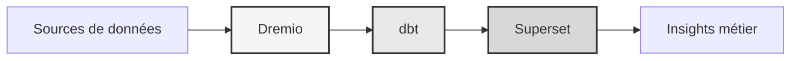

# Платформа данных

**Решение для хранения корпоративных данных**

**Язык**: французский (FR)  
**Версия**: 3.3.1  
**Последнее обновление**: 19 октября 2025 г.

---

## Обзор

Профессиональная платформа данных, объединяющая Dremio, dbt и Apache Superset для преобразования данных корпоративного уровня, обеспечения качества и бизнес-аналитики.

Эта платформа предоставляет комплексное решение для современной обработки данных, включая автоматизированные конвейеры данных, тестирование качества и интерактивные информационные панели.



---

## Ключевые особенности

- Архитектура дома на озере данных с помощью Dremio
- Автоматизированные преобразования с помощью dbt
- Бизнес-аналитика с Apache Superset
- Комплексное тестирование качества данных
- Синхронизация в реальном времени через Arrow Flight

---

## Краткое руководство

### Предварительные условия

- Докер 20.10 или выше
- Docker Compose 2.0 или выше
- Python 3.11 или выше
- Минимум 8 ГБ оперативной памяти

### Средство

```bash
# Installer les dépendances
pip install -r requirements.txt

# Démarrer les services
make up

# Vérifier l'installation
make status

# Exécuter les tests de qualité
make dbt-test
```

---

## Архитектура

### Компоненты системы

| Компонент | Порт | Описание |
|---------------|------|-------------|
| Дремио | 9047, 31010, 32010 | Платформа Lakehouse для данных |
| дбт | - | Инструмент преобразования данных |
| Суперсет | 8088 | Платформа бизнес-аналитики |
| PostgreSQL | 5432 | Транзакционная база данных |
| МинИО | 9000, 9001 | Объектное хранилище (совместимо с S3) |
| Эластичный поиск | 9200 | Поисковая и аналитическая система |

Подробную информацию о проектировании системы см. в [документации по архитектуре](architecture/).

---

## Документация

### Запускать
- [Руководство по установке](начало работы/)
- [Конфигурация](начало работы/)
- [Начало работы](начало работы/)

### Руководства пользователя
- [Инженерия данных](руководства/)
- [Создание дашбордов](гайды/)
- [Интеграция API](руководства/)

### Документация по API
- [Справочник по REST API](api/)
- [Аутентификация](api/)
- [Примеры кода](api/)

### Архитектурная документация
- [Проектирование системы](архитектура/)
- [Поток данных](архитектура/)
- [Руководство по развертыванию](архитектура/)
- [🎯 Визуальное руководство по портам Dremio](architecture/dremio-ports-visual.md) ⭐ НОВИНКА

---

## Доступные языки

| Язык | Код | Документация |
|--------|------|---------------|
| английский | RU | [README.md](../../../README.md) |
| французский | RU | [docs/i18n/fr/](../fr/README.md) |
| испанский | ЭС | [docs/i18n/es/](../es/README.md) |
| Португальский | ПТ | [docs/i18n/pt/](../pt/README.md) |
| عربية | АР | [docs/i18n/ar/](../ar/README.md) |
| 中文 | Китай | [docs/i18n/cn/](../cn/README.md) |
| 日本語 | Япония | [docs/i18n/jp/](../jp/README.md) |
| Русский | Великобритания | [docs/i18n/ru/](../ru/README.md) |

---

## Поддерживать

Для технической помощи:
- Документация: [README main](../../../README.md)
- Отслеживание проблем: проблемы GitHub
- Форум сообщества: обсуждения на GitHub.
- Электронная почта: support@example.com.

---

**[Вернуться к основной документации](../../../README.md)**