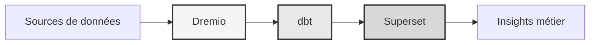

#Nền tảng dữ liệu

**Giải pháp kho dữ liệu doanh nghiệp**

**Ngôn ngữ**: Tiếng Pháp (FR)  
**Phiên bản**: 3.3.1  
**Cập nhật lần cuối**: Ngày 19 tháng 10 năm 2025

---

## Tổng quan

Nền tảng dữ liệu chuyên nghiệp kết hợp Dremio, dbt và Apache Superset để chuyển đổi dữ liệu cấp doanh nghiệp, đảm bảo chất lượng và kinh doanh thông minh.

Nền tảng này cung cấp giải pháp hoàn chỉnh cho kỹ thuật dữ liệu hiện đại, bao gồm đường dẫn dữ liệu tự động, kiểm tra chất lượng và bảng điều khiển tương tác.



---

## Tính năng chính

- Kiến trúc data lakehouse với Dremio
- Chuyển đổi tự động với dbt
- Kinh doanh thông minh với Apache Superset
- Kiểm tra chất lượng dữ liệu toàn diện
- Đồng bộ hóa thời gian thực thông qua Arrow Flight

---

## Hướng dẫn bắt đầu nhanh

### Điều kiện tiên quyết

- Docker 20.10 trở lên
- Docker Compose 2.0 trở lên
- Python 3.11 trở lên
- RAM tối thiểu 8GB

### Cơ sở

```bash
# Installer les dépendances
pip install -r requirements.txt

# Démarrer les services
make up

# Vérifier l'installation
make status

# Exécuter les tests de qualité
make dbt-test
```

---

## Ngành kiến ​​​​trúc

###Thành phần hệ thống

| Thành phần | Cảng | Mô tả |
|--------------|------|-------------|
| Dremio | 9047, 31010, 32010 | Nền tảng hồ dữ liệu |
| dbt | - | Công cụ chuyển đổi dữ liệu |
| Siêu bộ | 8088 | Nền tảng thông minh kinh doanh |
| PostgreSQL | 5432 | Cơ sở dữ liệu giao dịch |
| MinIO | 9000, 9001 | Lưu trữ đối tượng (tương thích với S3) |
| Elaticsearch | 9200 | Công cụ tìm kiếm và phân tích |

Xem [tài liệu kiến ​​trúc](architecture/) để biết thiết kế hệ thống chi tiết.

---

## Tài liệu

### Khởi động
- [Hướng dẫn cài đặt](bắt đầu/)
- [Cấu hình](bắt đầu/)
- [Bắt đầu](bắt đầu/)

### Hướng dẫn sử dụng
- [Kỹ thuật dữ liệu](guides/)
- [Tạo trang tổng quan](guides/)
- [Tích hợp API](guides/)

### Tài liệu API
- [Tham khảo API REST](api/)
- [Xác thực](api/)
- [Ví dụ về mã](api/)

### Tài liệu kiến ​​trúc
- [Thiết kế hệ thống](architecture/)
- [Luồng dữ liệu](architecture/)
- [Hướng dẫn triển khai](architecture/)
- [🎯 Hướng dẫn trực quan về cổng Dremio](architecture/dremio-ports-visual.md) ⭐ MỚI

---

## Ngôn ngữ có sẵn

| Ngôn ngữ | Mã | Tài liệu |
|--------|------|---------------|
| Tiếng Anh | VN | [README.md](../../../README.md) |
| Tiếng Pháp | VN | [docs/i18n/fr/](../fr/README.md) |
| Tây Ban Nha | ES | [docs/i18n/es/](../es/README.md) |
| Tiếng Bồ Đào Nha | PT | [docs/i18n/pt/](../pt/README.md) |
| العربية | AR | [docs/i18n/ar/](../ar/README.md) |
| 中文 | CN | [docs/i18n/cn/](../cn/README.md) |
| 日本語 | JP | [docs/i18n/jp/](../jp/README.md) |
| Русский | Vương quốc Anh | [docs/i18n/ru/](../ru/README.md) |

---

## Ủng hộ

Để được hỗ trợ kỹ thuật:
- Tài liệu: [README main](../../../README.md)
- Trình theo dõi sự cố: Sự cố GitHub
- Diễn đàn cộng đồng: Thảo luận GitHub
- Email: support@example.com

---

**[Quay lại tài liệu chính](../../../README.md)**